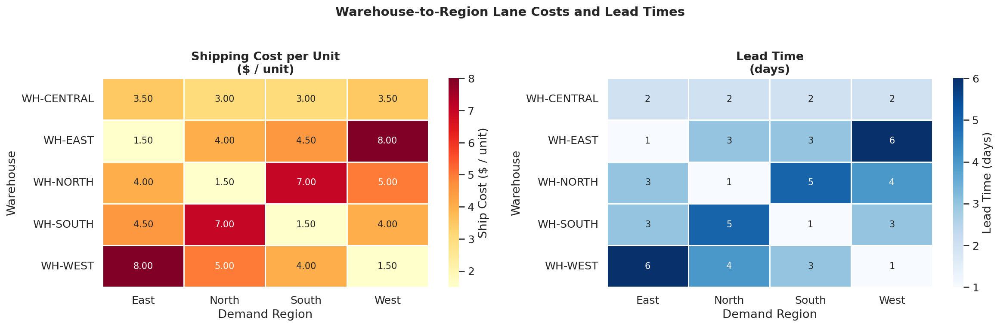
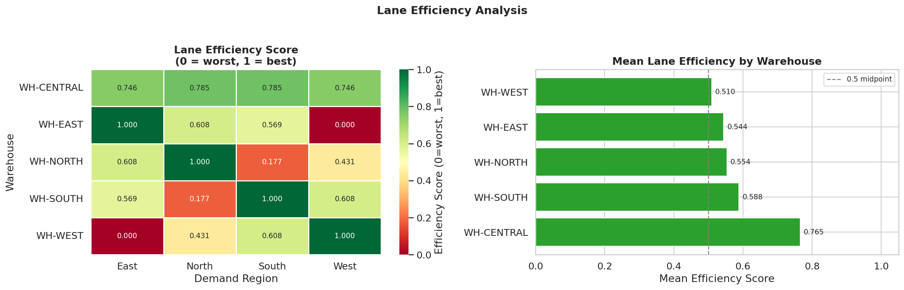
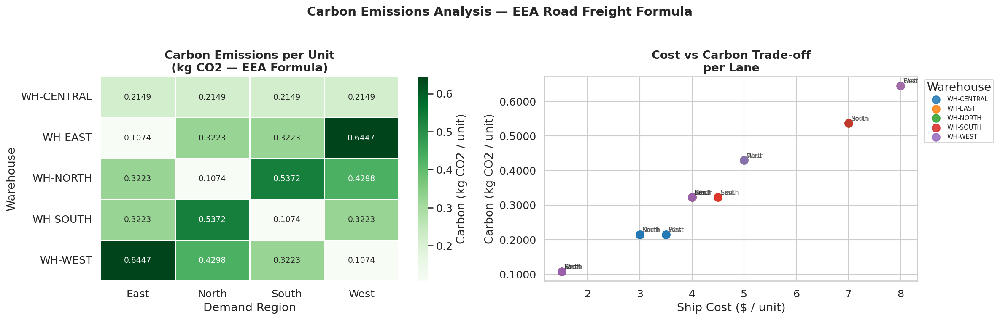

# EDA Report — Costs and Carbon

**Generated** : 2026-04-22 12:35 UTC
**Script**    : eda_costs_carbon.py

---

## 1. Lane Cost Overview

| Metric | Warehouse | Region | Value |
|--------|-----------|--------|-------|
| Cheapest lane | WH-EAST | East | $1.50/unit |
| Costliest lane | WH-EAST | West | $8.00/unit |
| Fastest lane | WH-EAST | East | 1 day(s) |
| Slowest lane | WH-EAST | West | 6 days |

**All 20 lanes:**

| Warehouse | Region | Ship Cost ($/unit) | Lead Time (days) | Efficiency |
|-----------|--------|--------------------|------------------|------------|
| WH-CENTRAL | East | $3.50 | 2 | 0.7462 |
| WH-CENTRAL | North | $3.00 | 2 | 0.7846 |
| WH-CENTRAL | South | $3.00 | 2 | 0.7846 |
| WH-CENTRAL | West | $3.50 | 2 | 0.7462 |
| WH-EAST | East | $1.50 | 1 | 1.0000 |
| WH-EAST | North | $4.00 | 3 | 0.6077 |
| WH-EAST | South | $4.50 | 3 | 0.5692 |
| WH-EAST | West | $8.00 | 6 | 0.0000 |
| WH-NORTH | East | $4.00 | 3 | 0.6077 |
| WH-NORTH | North | $1.50 | 1 | 1.0000 |
| WH-NORTH | South | $7.00 | 5 | 0.1769 |
| WH-NORTH | West | $5.00 | 4 | 0.4308 |
| WH-SOUTH | East | $4.50 | 3 | 0.5692 |
| WH-SOUTH | North | $7.00 | 5 | 0.1769 |
| WH-SOUTH | South | $1.50 | 1 | 1.0000 |
| WH-SOUTH | West | $4.00 | 3 | 0.6077 |
| WH-WEST | East | $8.00 | 6 | 0.0000 |
| WH-WEST | North | $5.00 | 4 | 0.4308 |
| WH-WEST | South | $4.00 | 3 | 0.6077 |
| WH-WEST | West | $1.50 | 1 | 1.0000 |

---

## 2. Lane Efficiency

| Metric | Value |
|--------|-------|
| Best warehouse (avg efficiency) | WH-CENTRAL (0.7654) |
| Worst warehouse (avg efficiency) | WH-WEST (0.5096) |
| Perfect lanes (score = 1.0) | 4 |
| Zero-score lanes (score = 0.0) | 2 |

---

## 3. Carbon Emissions

**Formula:** `carbon_kg = distance_km x weight_tonnes x 0.062`

| Metric | Value |
|--------|-------|
| Min carbon per unit | 0.107447 kg CO2 |
| Max carbon per unit | 0.644684 kg CO2 |
| Mean carbon per unit | 0.322342 kg CO2 |
| Greenest lane | WH-EAST → East (0.107447 kg) |
| Dirtiest lane | WH-EAST → West (0.644684 kg) |

---

## 4. Figures Index

| # | Filename | Description |
|---|----------|-------------|
| 1 | eda_costs_lane_heatmap.png | Ship cost and lead time heatmaps |
| 2 | eda_costs_efficiency_scores.png | Lane efficiency heatmap and bar |
| 3 | eda_costs_carbon_placeholder.png | Carbon per unit heatmap and scatter |

*End of EDA costs and carbon report.*