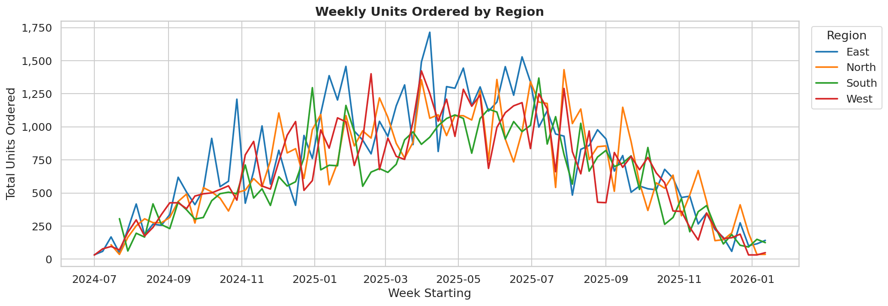
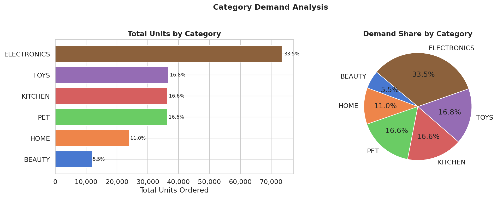
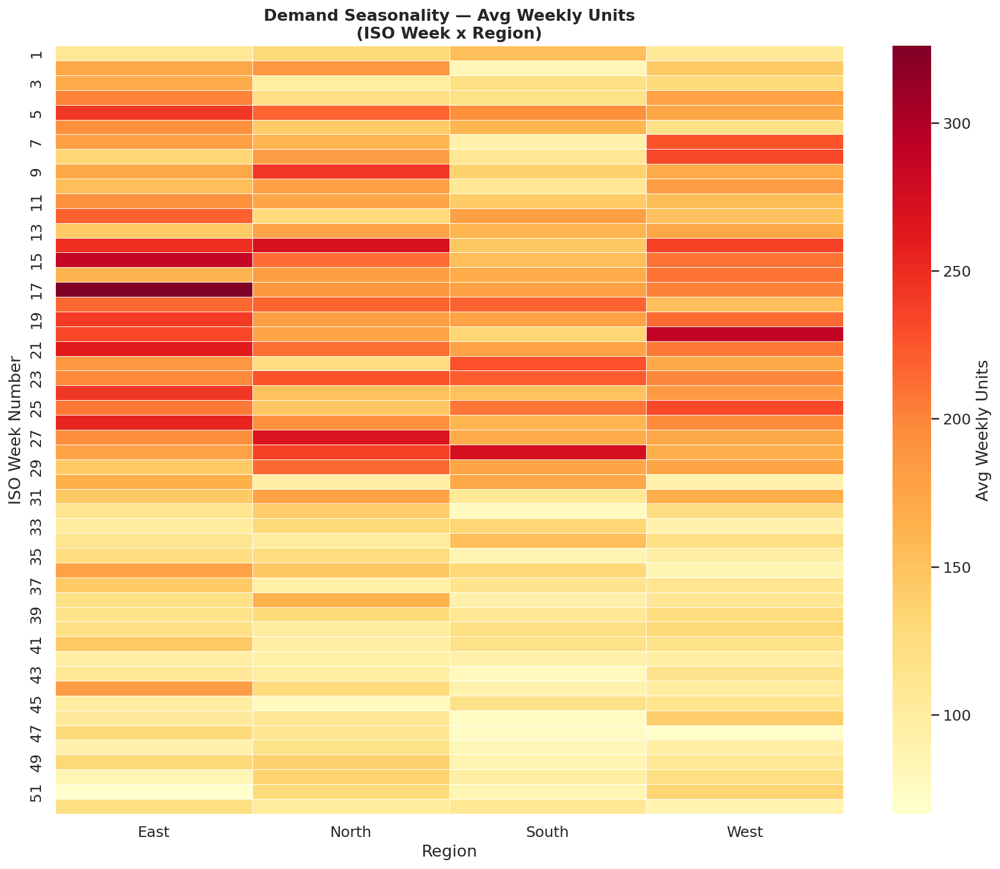
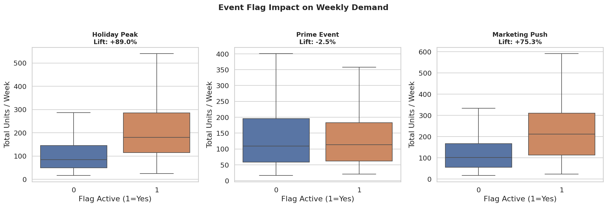
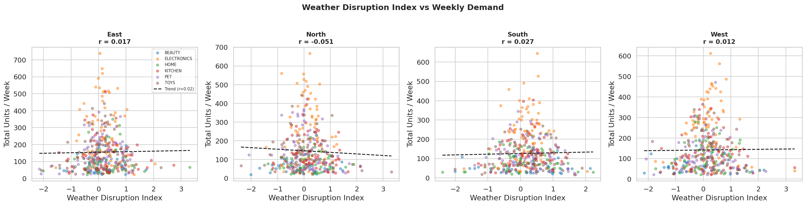

# EDA Report — Demand Signal

**Generated** : 2026-04-22 12:26 UTC
**Script**    : eda_demand.py

---

## 1. Dataset Overview

| Metric | Value |
|--------|-------|
| Weekly grain rows | 1,540 |
| ISO weeks covered | 81 |
| Date range | 2024-07-01 to 2026-01-12 |
| Regions | 4 |
| Categories | 6 |
| Total units ordered | 219,180 |

---

## 2. Regional Demand Patterns

| Region | Total Units | Avg Weekly | Std Dev |
|--------|-------------|------------|---------|
| East | 60,559 | 747.6 | 430.6 |
| North | 55,366 | 700.8 | 365.7 |
| South | 49,419 | 633.6 | 326.4 |
| West | 53,836 | 664.6 | 380.2 |

---

## 3. Category Demand Share

| Category | Total Units | Share % |
|----------|-------------|---------|
| ELECTRONICS | 73,464 | 33.5% |
| TOYS | 36,788 | 16.8% |
| KITCHEN | 36,458 | 16.6% |
| PET | 36,412 | 16.6% |
| HOME | 24,095 | 11.0% |
| BEAUTY | 11,963 | 5.5% |

---

## 4. Seasonality Heatmap

**Top-5 hottest week x region cells:**

| Rank | ISO Week | Region | Avg Units |
|------|----------|--------|-----------|
| 1 | W17 | East | 326.0 |
| 2 | W20 | West | 289.0 |
| 3 | W15 | East | 285.8 |
| 4 | W28 | South | 273.8 |
| 5 | W14 | North | 271.2 |

---

## 5. Event Flag Demand Lift

| Flag | Demand Lift When Active |
|------|------------------------|
| Holiday Peak | +89.0% |
| Prime Event | -2.5% |
| Marketing Push | +75.3% |

---

## 6. Weather Disruption vs Demand

| Region | Pearson r |
|--------|-----------|
| East | 0.017 |
| North | -0.051 |
| South | 0.027 |
| West | 0.012 |

---

## 7. Figures Index

| # | Filename | Description |
|---|----------|-------------|
| 1 | eda_demand_weekly_units_by_region.png | Weekly demand trends per region |
| 2 | eda_demand_units_by_category.png | Category demand share |
| 3 | eda_demand_seasonality_heatmap.png | ISO-week x region heatmap |
| 4 | eda_demand_event_flag_impact.png | Box-plots of flag lift |
| 5 | eda_demand_weather_vs_units.png | Weather scatter per region |

*End of EDA demand report.*