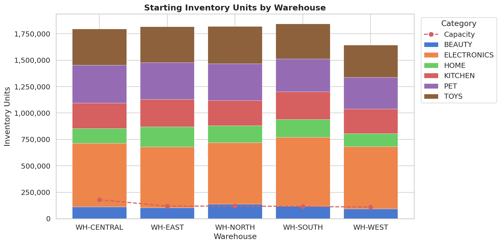
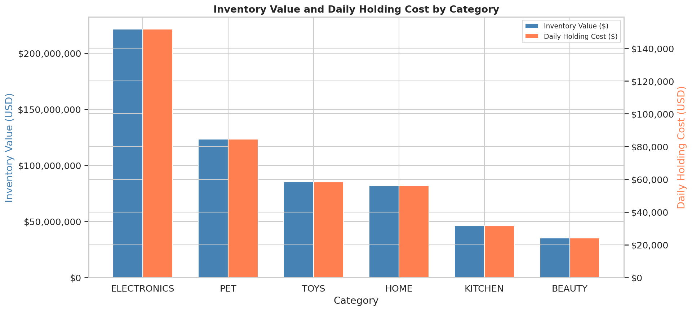
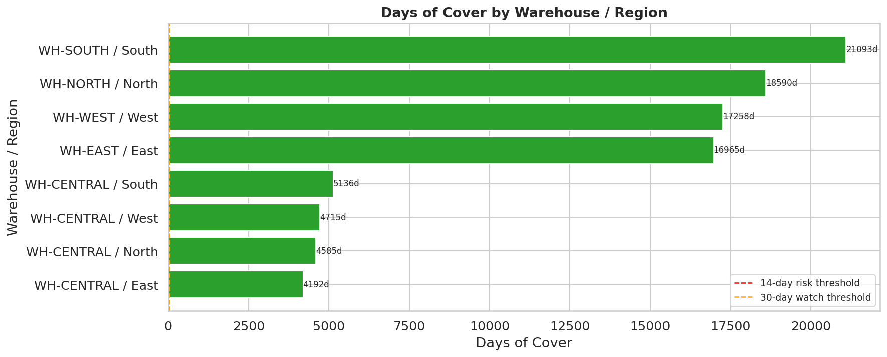

# EDA Report — Inventory Position

**Generated** : 2026-04-22 12:30 UTC
**Script**    : eda_inventory.py

---

## 1. Portfolio Overview

| Metric | Value |
|--------|-------|
| Total SKUs | 5,000 |
| Total units on hand | 8,926,517 |
| Total inventory value | $593,317,335.34 |
| Daily holding cost | $406,381.70 |

---

## 2. Units and Utilisation by Warehouse

| Warehouse | Units on Hand | Capacity | Utilisation % | Value ($) |
|-----------|---------------|----------|---------------|-----------|
| WH-CENTRAL | 1,797,061 | 180,000 | 998.4% | $121,911,459 |
| WH-EAST | 1,818,359 | 118,000 | 1541.0% | $121,738,471 |
| WH-NORTH | 1,821,735 | 120,000 | 1518.1% | $118,484,326 |
| WH-SOUTH | 1,844,982 | 115,000 | 1604.3% | $122,550,292 |
| WH-WEST | 1,644,380 | 110,000 | 1494.9% | $108,632,787 |

---

## 3. Inventory Value by Category

| Category | Units | Value ($) | Daily Hold Cost ($) |
|----------|-------|-----------|---------------------|
| ELECTRONICS | 2,997,265 | $221,271,324 | $151,555.91 |
| PET | 1,661,361 | $123,300,364 | $84,452.23 |
| TOYS | 1,677,402 | $85,285,994 | $58,414.87 |
| HOME | 780,758 | $82,043,956 | $56,194.64 |
| KITCHEN | 1,238,341 | $46,075,226 | $31,558.25 |
| BEAUTY | 571,390 | $35,340,472 | $24,205.79 |

---

## 4. Days of Cover

| Metric | Value |
|--------|-------|
| Min DoC | 4191.5 days |
| Max DoC | 21093.4 days |
| Mean DoC | 11566.7 days |
| At-risk lanes (DoC < 14) | 0 |
| Watch lanes (14-30 days) | 0 |
| Healthy lanes (>= 30 days) | 8 |

**Detail by warehouse / region:**

| Warehouse | Region | Inv Units | Avg Daily Demand | Days of Cover |
|-----------|--------|-----------|------------------|---------------|
| WH-CENTRAL | East | 449,265 | 107.2 | 4192 |
| WH-CENTRAL | North | 449,265 | 98.0 | 4585 |
| WH-CENTRAL | West | 449,265 | 95.3 | 4715 |
| WH-CENTRAL | South | 449,265 | 87.5 | 5136 |
| WH-EAST | East | 1,818,359 | 107.2 | 16965 |
| WH-WEST | West | 1,644,380 | 95.3 | 17258 |
| WH-NORTH | North | 1,821,735 | 98.0 | 18590 |
| WH-SOUTH | South | 1,844,982 | 87.5 | 21093 |

---

## 5. Figures Index

| # | Filename | Description |
|---|----------|-------------|
| 1 | eda_inventory_units_by_warehouse.png | Units + capacity by warehouse |
| 2 | eda_inventory_value_by_category.png | Value and holding cost by category |
| 3 | eda_inventory_days_of_cover.png | Days of cover risk heatmap |

*End of EDA inventory report.*